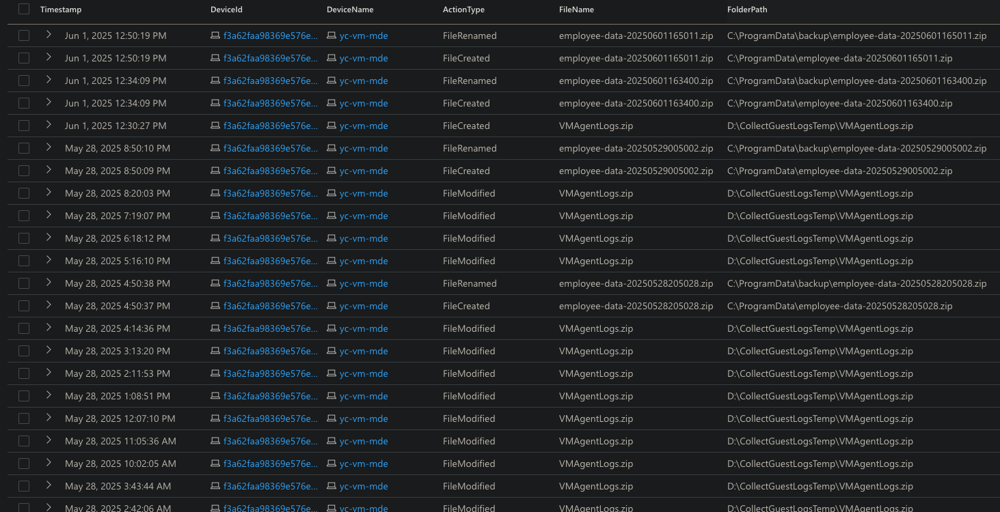
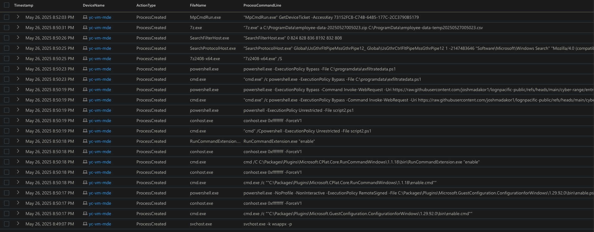

# Final Threat Hunt Report: Data Exfiltration from PIP'd Employee

## Overview
This report summarizes the investigation of suspicious activity conducted on the device `yc-vm-mde`, assigned to John Doe, a user placed on a Performance Improvement Plan (PIP). The goal was to determine if any insider threat or data exfiltration occurred using Microsoft Defender for Endpoint and KQL.

---

## Hypothesis
Due to John's elevated privileges and recent behavioral concerns, we hypothesized that he may attempt to compress and exfiltrate sensitive company data using administrator-level access.

---

## Key Observations

### File Compression
- `.zip` files named `employee-data.zip` were discovered using:
```kql
DeviceFileEvents
| where DeviceName == "yc-vm-mde"
| where FileName endswith ".zip"
| order by Timestamp desc
```
## Logs from DeviceFileEvents:


- Activity suggests staging of sensitive data for exfiltration.

### Process Activity
- `7z2408-x64.exe /S` was executed silently via PowerShell:
```kql
let specificTime = datetime(2025-05-27T00:50:31.4253997Z);
DeviceProcessEvents
| where Timestamp between ((specificTime - 2m) .. (specificTime + 2m))
| where DeviceName == "yc-vm-mde"
| project Timestamp, DeviceName, FileName, ProcessCommandLine
```
- Shows installation of 7-Zip followed by zip file creation.

## Logs from DeviceProcessEvents:


### Network Behavior
- Outbound SSL connections were made to public IPs:
```kql
DeviceNetworkEvents
| where DeviceName == "yc-vm-mde"
| where RemoteIP in ("20.42.65.84", "20.42.73.26", "20.60.133.132", "20.60.181.193")
| where Timestamp between (datetime(2025-05-27T00:48:31.4253997Z) .. datetime(2025-05-27T00:52:31.4253997Z))
```
- These connections were initiated by PowerShell with `-ExecutionPolicy Bypass`, indicating an attempt to bypass restrictions and send data externally.
## Logs from DeviceNetworkEvents:


---

## MITRE ATT&CK Mapping

| Tactic             | Technique                      | ID         |
|--------------------|--------------------------------|------------|
| Execution          | PowerShell                     | T1059.001  |
| Collection         | Archive via Utility            | T1560.001  |
| Command & Control  | Encrypted Channel (HTTPS)      | T1071.001  |
| Exfiltration       | Exfiltration Over C2 Channel   | T1041      |

---

## Timeline of Events

| Time (UTC)           | Event Description                                |
|----------------------|---------------------------------------------------|
| 2025-05-27 00:48     | PowerShell begins executing script                |
| 2025-05-27 00:49     | 7-Zip installed silently                          |
| 2025-05-27 00:50     | `employee-data.zip` created                       |
| 2025-05-27 00:51     | Outbound SSL connections made to public IPs      |

---

## Analyst Response

- Isolated `yc-vm-mde` from the network  
- Initiated memory and disk acquisition for further forensic review  
- Blocked remote IPs and reviewed firewall policies  
- Rotated credentials used on the host  
- Created detections for similar behavior using MDE advanced hunting  

---

## Outcome

We confirmed that the employee used PowerShell to silently install a compression tool, archive sensitive data, and exfiltrate it via encrypted outbound traffic. This validates our insider threat hypothesis and triggered an internal incident response.

---
